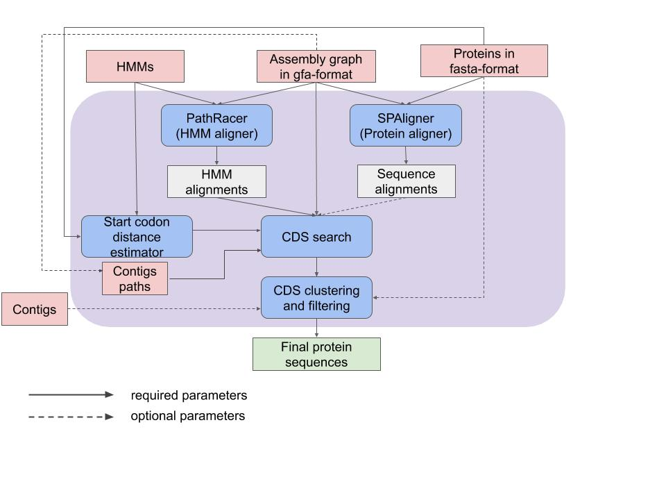

# ORF search in assembly graphs

Pipeline for generating potential gene sequences, ORFs (Open Reading Frames), from assembly graphs.

It incorporates the power of two graph alignment tools (PathRacer and SPAligner) and uses their output as initial anchors to search for full gene sequences in assembly graphs.

## Installation

The easiest way to install `orf-search` is via conda:
 
    conda create -n orf_search  -c tatianadvorkina -c conda-forge -c bioconda python=3.6 orf-search
    conda activate  orf_search

Alternatively you can download git repo and all packages by yourself.

The main pipeline is written in Python3 and uses several libraries described below (and in requirements.txt file).
- Python3
    - [biopython](https://biopython.org/wiki/Download)
    - [pyyaml](https://pyyaml.org/wiki/PyYAMLDocumentation)
    - [edlib](https://pypi.org/project/edlib/)
    - [joblib](https://joblib.readthedocs.io/en/latest/installing.html)
    - [argparse](https://pypi.org/project/argparse/)
    - [Mummer4](https://github.com/mummer4/mummer/releases)
    - [HMMer](http://hmmer.org)
- [PathRacer](https://github.com/ablab/spades/archive/v0.5-recomb.tar.gz)
- [SPAligner](https://github.com/ablab/spades/archive/spaligner-paper.tar.gz)

Execution files of PathRacer and SPAligner must be in `aligners/` folder.

Check sucessfull installation by running:

    orf_search.py --test

## Output

The output for the test run will be saved in `./tiny_dataset_test/` folder:
    
    ricinb_lectin2/                    PathRacer run results
    toxin/                             SPAligner run results
    orfs_raw.fasta                     Full list of ORFs that were found in assembly graph
    orfs_total.fasta                   List of ORFs after initial filtering
    orfs_graphonly.fasta               List of ORFs that can be found only in graph (not in contigs)
    orfs_novel.fasta                   List of novel ORFs (not presented in list of given protein sequences)
    orfs_final_clustered.fasta         List of ORFs clustered with 90% identity
    orfs_final_most_reliable.fasta     List of representatives for each cluster (usually contains 2-3 sequences per cluster)

## Running

Synopsis: 

    orf_search.py -m HMMS -g GRAPH -k KMER -o OUT [-s SEQUENCES] [-r] [-c CONTIGS] [-f] [-t THREADS] [-a]

Main parameters are:

`-m HMMS`
    list of HMMs in HMMer format that represent domains for PathRacer input

`-g GRAPH`
    path to assembly graph (in GFA format), it can contain paths (starting with `P` lines) that will be used in filtering

`-k KMER`
    assembly graph k-mer size

`-o OUT`
    output directory name

`-s SEQUENCES`
    list of known IPG sequences

`-r`
    run IPG sequences to graph alignemnt (may be time-consuming)

`-c CONTIGS`
    contigs sequences in fasta file

`-t THREADS`
    number of threads (default: 1)

`-a`
    do not perform filtering based on contigs or known IPGs

## Main algorithm

1. **Aligning insecticide proteins/HMMs to the assembly graph.** Our method uses SPAligner (Dvorkina et al, 2019) to align insecticide proteins to the assembly graph and retains all alignments with length exceeding 80% of the protein length. It also uses PathRacer (Shlemov and Korobeynikov, 2019) to align HMMs to the assembly graph and retains all alignments with e-value below 10-9 and length exceeding 90% of the HMM length. 
2. **Start and stop codon search.** For each alignment, our pipeline finds all putative start and stop codons in the assembly graph using the Breadth-First-Search (BFS).  The BFS search is performed on the graph where each vertex represents a pair: a position in the assembly graph and a frameshift string of length 0, 1, or 2, that stores the prefix of the current codon triplet. Information about sequences with start codons that are positioned after a stop codon in the graph is reflected in the CDS file.
3. **CDS generation.** For each start/stop codon of the partial alignment, toxinSPAdes generates a set of paths that lead from a start/stop codon position to the ends of the alignment. We run the bounded exhausting search through all prefixes/suffixes (limited to generating at most 1000 paths). For each pair of start and stop codon, all prefixes and suffixes are concatenated with the partial alignment and the resulting path (in nucleotides) is converted to the corresponding protein sequence. Finally, duplicate protein sequences are filtered out and all sequences that are found in a single contig (optional) and all sequences that represent known genes are not included into final output.
4. **ORFs filtering, clustering, and selecting representative ORFs.** All paths conflicting with some contig-paths are filtered out from the list of putative ORF paths and a set of representative ORFs is formed. 

## Contacts

For any questions or suggestions please do not hesitate to contact Tatiana Dvorkina <tedvorkina@gmail.com>.